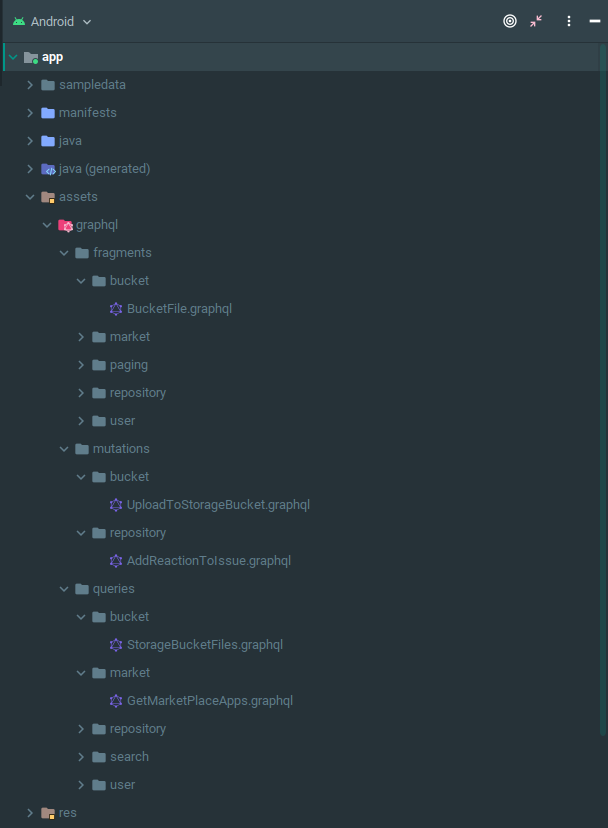
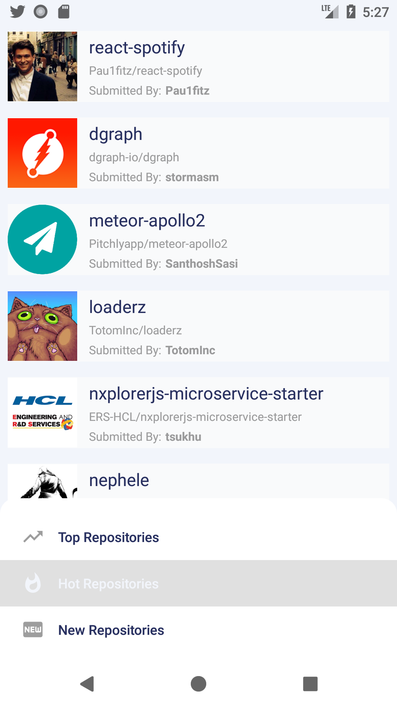
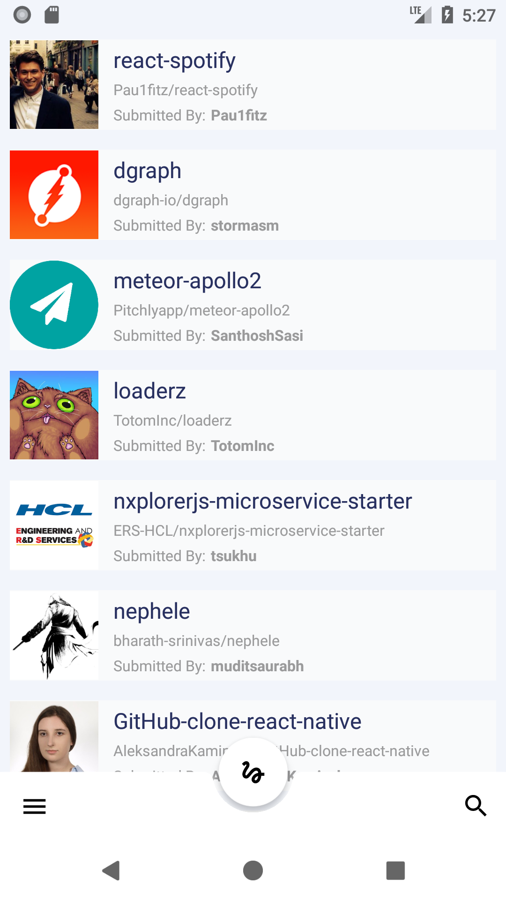
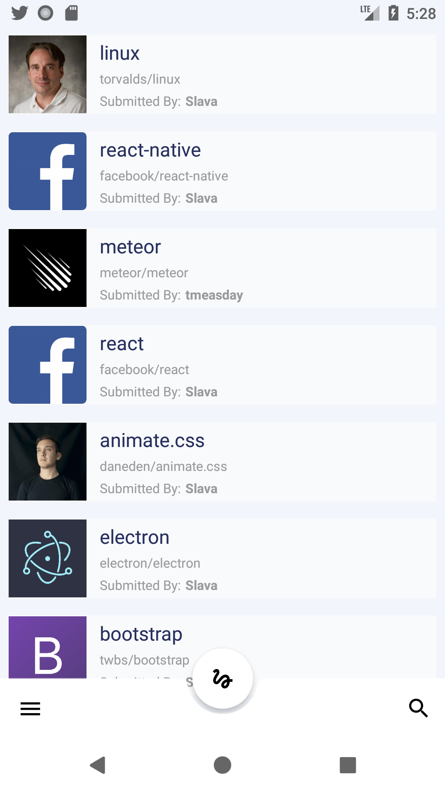

# Retrofit Converter - With GraphQL Support &nbsp; [](https://jitpack.io/#AniTrend/retrofit-graphql) &nbsp; [](https://www.codacy.com/app/AniTrend/retrofit-graphql?utm_source=github.com&amp;utm_medium=referral&amp;utm_content=AniTrend/retrofit-graphql&amp;utm_campaign=Badge_Grade) &nbsp; [](https://travis-ci.org/AniTrend/retrofit-graphql)

This is a retrofit converter which uses annotations to inject .graphql query or mutation files into a request body along with any GraphQL variables. The included example makes use of [GitHunt GraphQL API](http://api.githunt.com/graphiql) that sometimes responds with null fields, feel free to try it with any other GraphQL API like `GitHub API v4` also this project does not teach you how to use Retrofit, Glide or the ViewModel.

## Why This Project Exists?

Many might wonder why this exists when an android GraphQL library like [Apollo](https://github.com/apollographql/apollo-android) exists. Unfortunately Apollo for Android still lacks some basic but important features/functionality which led to the following questions about [General Design Questions Regarding Apollo](https://github.com/apollographql/apollo-android/issues/847), [Polymorphic Type Handling](https://github.com/apollographql/apollo-android/issues/334) and [Non Shared Types](https://github.com/apollographql/apollo-android/issues/898). Don't get me wrong Apollo is not inferior any way, it has amazing features such as:

- Code Generation (Classes and Data Types)
- Custom Scalar Types
- Cached Responses

But since model classes are automatically generated for you, the developer loses some flexibility, such as use of generics, abstraction and inheritance. Also Android Performance best practice suggests that developers should use StringDef and IntDef over enums and [here's why](https://stackoverflow.com/questions/29183904/should-i-strictly-avoid-using-enums-on-android).

Strangely there are tons of simple examples all over Medium using apollo graphql for Android, but none of them address these issues because most of them just construct a simple single resource request demo application. These look just fine at first glance until you start working with multiple data types and apollo starts generating classes for every fragment and query even if the data models are the same, or share similar properties. Thus this project came to be

____

## How Everything Works

Seeing how we already have a really powerful type-safe HTTP client for Android and Java [Retrofit](http://square.github.io/retrofit/) why not use it and extend it's functionality?

For a detailed example please clone the project and look at the included sample application. The entire project & example app makes use of the following libraries:

- [Retrofit](http://square.github.io/retrofit/)
- [Gson](https://github.com/google/gson)
- [Glide](https://bumptech.github.io/glide/)
- [Architecture Lifecycle](https://developer.android.com/topic/libraries/architecture/lifecycle)
- [ViewModel](https://developer.android.com/topic/libraries/architecture/viewmodel)
- [LiveData](https://developer.android.com/topic/libraries/architecture/livedata)
- [Koin](https://insert-koin.io/)
- [Coroutines](https://developer.android.com/kotlin/coroutines)

## The Basics

First, you'll need .graphql files for saving your GraphQL queries, fragments, and mutations. You can use this tool to generate your Insomnia workspaces into directories and files [insomnia-graphql-generator](https://github.com/AniTrend/insomnia-graphql-generator), placing them into your assets folder as shown below:



With respect to fragments, you have two options. Either place them inside your query file after the query definition, or put them in their own file under the `assets/graphql/Example/Fragment/` folder. You may also use a mixture of the two if you wish. Note, only define one fragment per file and make sure the name of the fragment matches the filename. Here's an example:

In the file `assets/graphql/Example/Query/Trending.graphql`, two fragments (`RepositoryFragment` and `UserFragment`) are referenced but not defined in the same file.
```graphql
query Trending($type: FeedType!, $offset: Int, $limit: Int) {
  feed(type: $type, offset: $offset, limit: $limit) {
    id
    hotScore
    repository {
      ...RepositoryFragment
    }
    postedBy {
      ...UserFragment
    }
  }
}
```

The `RepositoryFragment` lives in `assets/graphql/Example/Fragment/RepositoryFragment.graphql`. It happens to reference `UserFragment` which is also defined in its own file. Note, it is fine for fragments to reference other fragments.
```graphql
fragment RepositoryFragment on Repository {
  name
  full_name
  owner {
    ...UserFragment
  }
  stargazers_count
}
```

The `UserFragment` lives in `assets/graphql/Example/Fragment/UserFragment.graphql`:
```graphql
fragment UserFragment on User {
  login
  avatar_url
  html_url
}
```


- __Add the JitPack repository to your build file__

```javascript
allprojects {
	repositories {
		...
		maven { url 'https://jitpack.io' }
	}
}
```

- __Add the dependency__

```javascript
dependencies {
    implementation 'com.github.anitrend:retrofit-graphql:{latest_version}'
}
```

- __Optional R8 / ProGuard Rules__

If you are using R8 the shrinking and obfuscation rules are included automatically.

ProGuard users must manually copy the options from [this file](https://github.com/AniTrend/retrofit-graphql/blob/master/library/proguard-rules.pro). 

> You might also need [retrofit rules](https://github.com/square/retrofit/blob/master/retrofit/src/main/resources/META-INF/proguard/retrofit2.pro) and it's dependencies (OkHttp and Okio)
___

Next we make our retrofit interfaces and annotate them with the `@GraphQuery` annotation using the name of the .graphql file without the extention, this will allow the runtime resolution of the target file inside your assets to be loaded before the request is sent. e.g.

```java

    @POST("graphql")
    @GraphQuery("Trending")
    @Headers("Content-Type: application/json")
    suspend fun getTrending(@Body request: QueryContainerBuilder): Response<GraphContainer<TrendingFeed>>

    @POST("graphql")
    @GraphQuery("RepoEntries")
    @Headers("Content-Type: application/json")
    suspend fun getRepoEntries(@Body request: QueryContainerBuilder): Response<GraphContainer<EntryFeed>>
```

### Models

The model creation is up to the developer, this is where retrofit-graphql differs from apollo, this way you can design your models in anyway you desire.
There are tools available to aid in the task of creating models from JSON. For Kotlin there is [JSON To Kotlin Class](https://plugins.jetbrains.com/plugin/9960-json-to-kotlin-class-jsontokotlinclass-), a plugin for the IDEA product family.
There are also numerous tools available online e.g [jsonschema2pojo](http://www.jsonschema2pojo.org/). One can always start from there and then modify the automatically generated output.

By default the library supplies you with a `QueryContainerBuilder` which is a holder for your GraphQL variables and request.
Also __two__ basic top level models, which you don't have to use if you want to design your own:

#### QueryContainerBuilder

Suggest using this as is, but if you want to make your own that's not a problem either. The QueryContainerBuilder is used as follows:

_Given a .graphql files such as the following:_

```graphql
query Trending($type: FeedType!, $offset: Int, $limit: Int) {
  feed(type: $type, offset: $offset, limit: $limit) {
    id
    hotScore
    repository {
      ...RepositoryFragment
    }
    postedBy {
      ...UserFragment
    }
  }
}
```

_Adding parameters to the request would be done as follows:_

```java
val queryBuilder = QueryContainerBuilder()
            .putVariable("type", "TRENDING")
            .putVariable("offset", 1)
            .putVariable("limit", 15);
```

> You can also add a map to the query container using `putVariables()`
> ```java
> val queryBuilder = QueryContainerBuilder()
>             .putVariables(
>                 mapOf(
>                     "type" to feedType,
>                     "limit" to 20,
>                     "offset" to 1
>                 )
>             )
> ```

The QueryContainerBuilder is then passed into your retrofit interface method as parameter and that's it! Just like an ordinary retrofit application.


#### GraphError

Common GraphQL error that makes use of extension functions

```java
/**
 * Converts the response error response into an object.
 *
 * @return The error object, or null if an exception was encountered
 * @see Error
 */
fun Response<*>?.getError(): List<GraphError>? {
    try {
        if (this != null) {
            val responseBody = errorBody()
            val message = responseBody?.string()
            if (responseBody != null && !message.isNullOrBlank()) {
                val graphErrors= message.getGraphQLError()
                if (graphErrors != null)
                    return graphErrors
            }
        }
    } catch (ex: Exception) {
        ex.printStackTrace()
    }
    return null
}

private fun String.getGraphQLError(): List<GraphError>? {
    Log.e("GraphErrorUtil", this)
    val tokenType = object : TypeToken<GraphContainer<*>>() {}.type
    val graphContainer = Gson().fromJson<GraphContainer<*>>(this, tokenType)
    return graphContainer.errors
}
```

#### GraphContainer

Similar to the top level GraphQL response, but the data type is generic to allow easy reuse.

```java
data class GraphContainer<T>(
        val data: T?,
        val errors: List<GraphError>?
) { fun isEmpty(): Boolean = data == null }
```

### Automatic Persisted Queries

Persisted queries allows clients to use HTTP GET instead of HTTP POST, making it easier to cache in a CDN (which might not allow caching of HTTP POST). The automated part is that the protocol allows clients to register new query id:s on the fly, so they do not have to be known by the server beforehand.

Apollo outlines the protocol in a blog post: [Improve GraphQL Performance with Automatic Persisted Queries](https://blog.apollographql.com/improve-graphql-performance-with-automatic-persisted-queries-c31d27b8e6ea). And the exact protocol can be found here: [Persisted Query support with Apollo Link](https://github.com/apollographql/apollo-link-persisted-queries)

Due to the declarative nature of Retrofit services and that the details of the protocol can differ depending on the backend, It would not make sense if this library did the persisted query negotiation under the hood. Therefore it requires some setup on your part.

### Implementation

Since one query potentially require two web requests, there will also be two methods in the Retrofit service declaration

```java

    @GET("graphql")
    @Headers("Content-Type: application/json")
    fun getTrendingPersistedQuery(@Query("extensions") String extensions, @Query("operationName") String operationName, @Query("variables") String variables): Call<GraphContainer<TrendingFeed>>

    @POST("graphql")
    @GraphQuery("Trending")
    @Headers("Content-Type: application/json")
    fun getTrending(@Body QueryContainerBuilder queryContainerBuilder): Call<GraphContainer<TrendingFeed>>

```

Additionally, the protocol relies on the client sending a SHA256 hash calculated from the query. Only the contents of the query, not the whole web request body. You can use the `PersistedQueryHashCalculator` for this.

```java
    private fun persistedQueryRequest() {
        val queryName = "Trending"
        val persistedQueryHashCalculator = PersistedQueryHashCalculator(context?.applicationContext)
        val queryContainerBuilder = QueryContainerBuilder()
                .setOperationName(queryName)
                .putVariable("type", feedType)
                .putPersistedQueryHash(persistedQueryHashCalculator.getOrCreateAPQHash(queryName).orEmpty())

        val container = queryContainerBuilder.build()
        val queryParameters: PersistedQueryUrlParameters = PersistedQueryUrlParameterBuilder(container, Gson()).build()

        val indexModel = WebFactory.getInstance(context)
                .createService(IndexModel::class.java)

        val persistedQueryRequest = indexModel.getTrendingUsingPersistedQuery(queryParameters.extensions, queryParameters.operationName, queryParameters.variables)
        val fallbackRequest = indexModel.getTrending(queryContainerBuilder)

        doPersistedQueryNegotiation(
                persistedQueryRequest,
                fallbackRequest,
                result = { trendingFeed: TrendingFeed? ->
                    // do something with TrendingFeed
                },
                error = { error: Throwable? ->
                    // handle error
                }
        )
    }
```

Assuming that you use `retrofit2.Call` as your way of performing asynchronous web requests using Retrofit, an implementation of the negotiation part could look as such:

```java
    private fun <T> doPersistedQueryNegotiation(request: Call<GraphContainer<T>>,
                                                fallbackRequest: Call<GraphContainer<T>>,
                                                result: (T?) -> Unit,
                                                error: (Throwable?) -> Unit) {

        request.enqueue(object : retrofit2.Callback<GraphContainer<T>> {
            override fun onResponse(call: Call<GraphContainer<T>>, response: Response<GraphContainer<T>>) {
                if (shouldUseFallbackRequest(response.body())) {
                    // using fallback request
                    fallbackRequest.enqueue(object : retrofit2.Callback<GraphContainer<T>> {
                        override fun onResponse(call: Call<GraphContainer<T>>, response: Response<GraphContainer<T>>) {
                            // persisted Query successfully registered
                            handleResponse(response, result, error)
                        }
                        override fun onFailure(call: Call<GraphContainer<T>>, t: Throwable) {
                            error.invoke(t)
                        }
                    })
                } else {
                    // persisted Query responded successfully
                    handleResponse(response, result, error)
                }
            }
            override fun onFailure(call: Call<GraphContainer<T>>, t: Throwable) {
                // Error during initial persisted query request
                error.invoke(t)
            }
        })
    }

    private fun <T> shouldUseFallbackRequest(graphContainer: GraphContainer<T>?): Boolean {
        if (graphContainer!!.errors != null) {
            for ((message) in graphContainer.errors!!) {
                if (PersistedQueryErrors.APQ_QUERY_NOT_FOUND_ERROR.equals(message!!, ignoreCase = true)) {
                    // Persisted query not found
                    return true
                } else if (PersistedQueryErrors.APQ_NOT_SUPPORTED_ERROR.equals(message, ignoreCase = true)) {
                    // Persisted query not supported
                    return true
                }
            }
        }
        return false
    }

    private fun <T> handleResponse(response: Response<GraphContainer<T>>, result: (T?) -> Unit, error: (Throwable?) -> Unit) {
        if (response.isSuccessful && response.body()?.errors.isNullOrEmpty()) {
            result.invoke(response.body()?.data)
        } else {
            error.invoke(HttpException(response))
        }
    }
```

## Working Example

_Check the example project named app for a more extensive overview of how everything works_

## The Result

 &nbsp;  &nbsp; 

## Proof Of Concept?

This project is derived from [AniTrend](https://github.com/AniTrend/anitrend-app) which is already published on the PlayStore