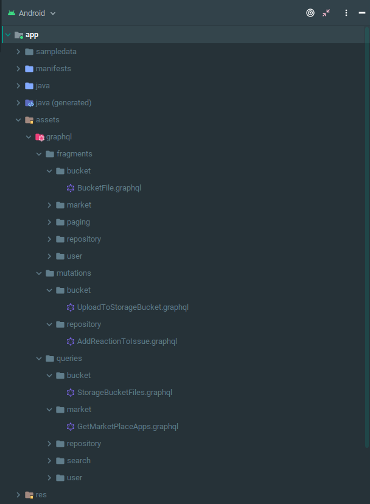
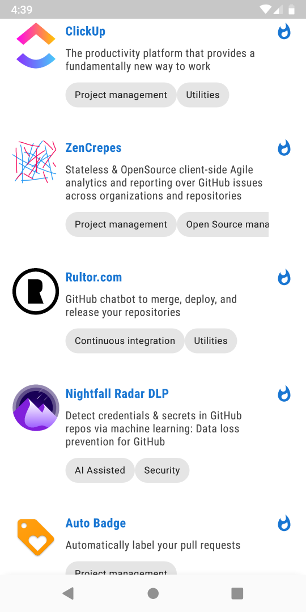
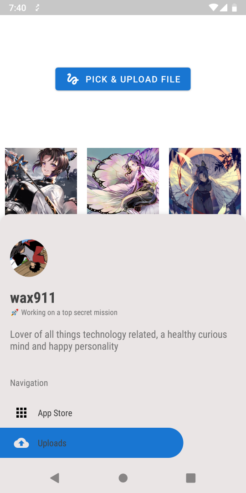
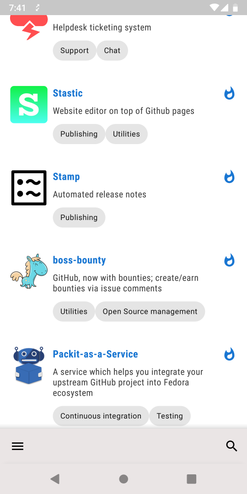
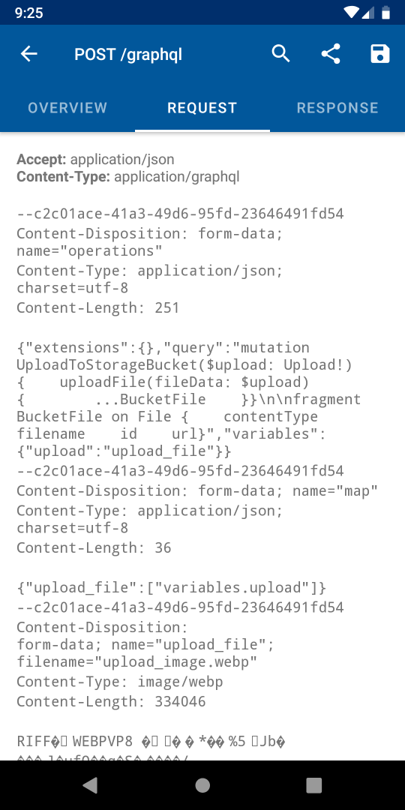

# Retrofit Converter - With GraphQL Support &nbsp; [](https://jitpack.io/#AniTrend/retrofit-graphql) &nbsp; [](https://app.codacy.com/gh/AniTrend/retrofit-graphql/dashboard?utm_source=gh&utm_medium=referral&utm_content=&utm_campaign=Badge_grade) &nbsp; [](https://github.com/AniTrend/retrofit-graphql/actions/workflows/android-test.yml)

Seeing how we already have a really powerful type-safe HTTP client for Android and Java
[Retrofit](http://square.github.io/retrofit/) why not use it and extend it's functionality,
this project is a retrofit converter which injects `.graphql` query or mutation file contents
into a request body along with any GraphQL variables. Supports both runtime asset-based
discovery and optional build-time code generation for type-safe request helpers.

> **Note:** As of the current release, retrofit-graphql is split into a backend-neutral core and an explicit serialization layer. The public contracts (`GraphQLOperationRequest`, `GraphQLResponse`, `GraphQLDocumentRegistry`) in `:api` carry no serializer, Gson, or kotlinx dependency. The new `GraphQLConverterFactory` in `:runtime` requires an explicit `GraphQLTransportCodec` (Gson or kotlinx.serialization), and the legacy serializer-coupled surface (`GraphConverter`, `GraphContainer`, `GraphQLRequest`, `GraphQLJson`, `GraphError`, `QueryContainerBuilder`, the `io.github.wax911.library.*` aliases) lives in the deprecated `:compat` module. See [MIGRATION.md](MIGRATION.md) for migration guidance from v2.x GraphQLJson + Gson workflows.

## Why This Project Exists?

Many might wonder why this exists when an android GraphQL library like [Apollo](https://github.com/apollographql/apollo-android) exists. Unfortunately Apollo for Android still lacks some basic but important features/functionality which led to the following questions about [General Design Questions Regarding Apollo](https://github.com/apollographql/apollo-android/issues/847), [Polymorphic Type Handling](https://github.com/apollographql/apollo-android/issues/334) and [Non Shared Types](https://github.com/apollographql/apollo-android/issues/898). Don't get me wrong Apollo is not inferior any way, it has amazing features such as:

- Code Generation (Classes and Data Types)
- Custom Scalar Types
- Cached Responses

But since model classes are automatically generated for you, the developer loses some flexibility, such as use of generics, abstraction and inheritance.
Also Android Performance best practice suggests that developers should use StringDef and IntDef over
enums and [here's why](https://stackoverflow.com/questions/29183904/should-i-strictly-avoid-using-enums-on-android), with the exception of kotlin
especially when using R8.

> **Note:** As of v2.x, retrofit-graphql also offers optional build-time code generation via a Gradle plugin. This combines the flexibility of file-based queries with type-safe request helpers when desired.
>
> The codegen plugin emits serialization annotations on generated types per the configured `serializationBackend` (`NONE`/`KOTLINX`/`GSON`), while the runtime serialization layer is a pluggable, backend-neutral `GraphQLTransportCodec` SPI. Generated request helpers return the neutral `GraphQLOperationRequest`; generated documents, hashes, and the document registry are backend-independent. The deprecated `GraphQLJson` abstraction (with `GsonGraphQLJson`/`KotlinxGraphQLJson`) still exists for the legacy `GraphConverter` path in `:compat`. See [MIGRATION.md](MIGRATION.md) for migration guidance.

Strangely there are tons of simple examples all over Medium using apollo graphql for Android,
but none of them address these issues because most of them just construct a simple single resource
request demo application. These look just fine at first glance until you start working with multiple data types and apollo starts generating classes for every fragment and query even if the data models are the same, or share similar properties.

See a list of changes from [here](./CHANGELOG.md)
____

## How Everything Works

### Getting Started

- __Add the JitPack repository to your build file__

```javascript
allprojects {
    repositories {
        ...
        maven { url 'https://www.jitpack.io' }
    }
}
```

- __Add the dependency__

```javascript
dependencies {
    implementation 'com.github.anitrend:retrofit-graphql:{latest_version}'
}
```

### Modular Dependencies (Recommended)

As of v2.x, the library is organized into composable modules. Instead of depending on the monolithic aggregator, you can depend only on the modules you need. The JitPack coordinates follow the pattern `com.github.AniTrend.retrofit-graphql:{module}:{tag}`:

```kotlin
repositories {
    maven { url = uri("https://www.jitpack.io") }
}

dependencies {
    // Backend-neutral converter factory (requires an explicit GraphQLTransportCodec)
    implementation("com.github.AniTrend.retrofit-graphql:runtime:{latest_version}")

    // Backend-neutral protocol/operation/registry contracts
    implementation("com.github.AniTrend.retrofit-graphql:api:{latest_version}")

    // Backend-neutral codec contract (GraphQLTransportCodec)
    implementation("com.github.AniTrend.retrofit-graphql:serialization-api:{latest_version}")

    // A built-in transport codec -- pick one. No serializer is bundled by default.
    implementation("com.github.AniTrend.retrofit-graphql:serialization-kotlinx:{latest_version}")
    // implementation("com.github.AniTrend.retrofit-graphql:serialization-gson:{latest_version}")

    // Deprecated legacy surface only -- GraphConverter, GraphContainer, GraphQLRequest,
    // GraphQLJson, QueryContainerBuilder, and the io.github.wax911.library.* aliases.
    // Required when you keep the asset-based @GraphQuery flow or legacy FQCNs.
    // implementation("com.github.AniTrend.retrofit-graphql:compat:{latest_version}")

    // Asset-based query discovery
    implementation("com.github.AniTrend.retrofit-graphql:android-assets:{latest_version}")

    // @GraphQuery annotation (only needed for asset-based queries, not codegen)
    implementation("com.github.AniTrend.retrofit-graphql:annotations:{latest_version}")
}
```

> **Note:** `:runtime` currently publishes `:android-assets` with `api` scope, so those types are already available transitively to consumers. Codegen-only consumers do not need direct `:android-assets` or `:annotations` dependencies — they are pulled transitively via `:runtime`. Keep direct dependencies only when you use the asset-based `@GraphQuery` workflow alongside codegen.

> **Note:** `:api` is backend-neutral: it does not apply Gson, kotlinx.serialization, or Parcelize, so modular consumers never need `kotlinx-serialization-core` for the contracts alone. The kotlinx runtime artifacts are only needed when you use the kotlinx codec (`:serialization-kotlinx`) or generate `@Serializable` types with `serializationBackend = KOTLINX`.

> **For internal development in this repository**, use project references instead of JitPack coordinates:
> ```kotlin
> dependencies {
>     implementation(project(":runtime"))
>     implementation(project(":api"))
>     implementation(project(":serialization-api"))
>     implementation(project(":serialization-kotlinx"))
>     implementation(project(":compat")) // legacy surface only
>     implementation(project(":android-assets"))
>     implementation(project(":annotations"))
> }
> ```

The deprecated monolithic aggregator remains available for backward compatibility. It re-exports every module including `:compat`, so every legacy class and alias exists exactly once on the aggregate classpath:

```kotlin
dependencies {
    implementation("com.github.AniTrend:retrofit-graphql:{latest_version}")
}
```

> Root artifact coordinates use `com.github.AniTrend`, while module coordinates use `com.github.AniTrend.retrofit-graphql`.

For code generation support, apply the Gradle plugin and add a `retrofitGraphQL { }` config block. The plugin generates operation constants, a document registry, enum classes, variable classes, typed request helpers, and optionally response model data classes. See [MIGRATION.md](MIGRATION.md) for the full migration guide and the [wiki Code Generation page](https://github.com/AniTrend/retrofit-graphql/wiki/Codegen) for the DSL reference.

### Serialization Backend Configuration

The `serializationBackend` property controls which serialization annotations the codegen plugin emits on generated types (`@Serializable`/`@SerialName` for kotlinx, `@SerializedName` for Gson). It is independent from the runtime transport codec you register on Retrofit:

```kotlin
retrofitGraphQL {
    common {
        serializationBackend.set(SerializationBackend.KOTLINX)  // or .GSON or .NONE
    }
}
```

| Value | Behavior |
|-------|----------|
| `NONE` | Strict: no serialization annotations emitted. Classes are generated as plain data holders, and abstract types (interfaces/unions) as plain sealed interfaces. `NONE` is never upgraded to another backend, even with `generateResponses = true`. |
| `KOTLINX` | Emits `@Serializable`, `@SerialName`, and polymorphic markers (`@JsonClassDiscriminator("__typename")`). Supports response models with interface/union paths. |
| `GSON` | Emits `@SerializedName` on properties. Supports response models for concrete-only operations (no interface/union types). |

**No backend is preferred and no backend is auto-selected.** `NONE` stays `NONE`; if you want annotations you must configure them explicitly. Generated operation constants, documents, hashes, and the document registry are **backend-independent**: they carry no serializer types, and the executable documents always inject `__typename` for abstract operations so the wire payload stays the same regardless of backend.

The `serializationBackend` property can be set in `common {}` (applies to all targets) and overridden per-target in `target("name") { }` blocks.

### Response Model Generation (Opt-in)

When `generateResponses` is enabled, the codegen plugin generates response model data classes from the operation selection sets, annotated per the configured `serializationBackend`. Each operation produces a `{OperationName}Data` root class with nested data classes for every selected GraphQL object type.

```kotlin
retrofitGraphQL {
    common {
        generateResponses.set(true)  // default false
        // serializationBackend is used as-is: NONE stays plain, no auto-selection
    }
    target("anilist") {
        schema.set(file("src/main/graphql/schema.graphql"))
        operations.from(fileTree("src/main/graphql"))
    }
}
```

Generated response models:
- Use `@Serializable`/`@SerialName` (KOTLINX), `@SerializedName` (GSON), or no annotations at all (NONE)
- Preserve GraphQL aliases as distinct Kotlin properties
- Handle list nullability (container + element)
- Support conditional fields (`@include`/`@skip`) with nullable types
- Generate sealed interfaces for GraphQL interfaces and unions; KOTLINX adds `__typename`-based polymorphism via `@JsonClassDiscriminator`, NONE emits plain sealed structures (dispatch is then the consumer's or the codec's responsibility)
- Escape Kotlin keywords by appending `Value` suffix (e.g. `private` -> `privateValue`) while preserving the original wire name in `@SerialName`

**Using generated response DTOs with Retrofit** (backend-neutral contracts):

```kotlin
// Retrofit interface: declare GraphQLResponse<GeneratedOperationData> as the return type
internal interface UserRemoteSource {
    @POST("graphql")
    suspend fun getCurrentUser(
        @Body request: GraphQLOperationRequest<EmptyGraphQLVariables>
    ): Response<GraphQLResponse<GetCurrentUserData>>
}

// Register the explicit-codec factory on Retrofit:
val retrofit = Retrofit.Builder()
    .addConverterFactory(
        GraphQLConverterFactory.create(
            codec = KotlinxGraphQLTransportCodec(), // or GsonGraphQLTransportCodec()
            registry = GeneratedGraphQLRegistry,
        )
    )
    .baseUrl(baseUrl)
    .build()

// Generated types are transport DTOs. Map them to your domain models at the Retrofit boundary:
class UserResponseMapper : GraphQLMapper<GetCurrentUserData, UserEntity>() {
    override suspend fun onResponseMapFrom(source: GetCurrentUserData): UserEntity {
        val viewer = source.viewer ?: throw IllegalStateException("No viewer data")
        return UserEntity(
            id = viewer.id,
            login = viewer.login,
            name = viewer.name,
            bio = viewer.bio,
        )
    }
}
```

Generated types are transport DTOs designed for the Retrofit/network boundary. Map them to your domain models rather than exposing generated classes throughout your application.

### Serialization: Two Layers

retrofit-graphql has two independent serialization layers:

1. **Runtime transport codecs (new)** -- `GraphQLTransportCodec` implementations consumed by `GraphQLConverterFactory` in `:runtime`. The codec owns all wire behavior: encoding the `GraphQLOperationRequest` envelope and decoding the neutral `GraphQLResponse` envelope (including `GraphQLData.Absent` vs `Present(null)`, typed error `path` segments, required error `message`, and `extensions` as `GraphQLValue.ObjectValue`). Two built-in codecs ship in optional modules:
   - `KotlinxGraphQLTransportCodec` (`:serialization-kotlinx`)
   - `GsonGraphQLTransportCodec` (`:serialization-gson`)

   No codec is preferred over the other; capability differences are expected and documented per codec. The codec is **mandatory and explicit** on every `GraphQLConverterFactory.create(...)` call -- there is no default backend and no reflection-based selection.

2. **Legacy `GraphQLJson` seam (deprecated, `:compat`)** -- the pluggable abstraction used by the deprecated `GraphConverter` path. `GsonGraphQLJson` and `KotlinxGraphQLJson` ship from `:compat`. New code should use the codec SPI instead.

**kotlinx.serialization (`:serialization-kotlinx`)** for the codec path offers:

- Compile-time serializer generation -- no reflection, R8-safe by default
- Automatic `@SerialName` matching on generated response DTOs
- No need for custom keep rules on generated types

**Gson (`:serialization-gson`)** for the codec path offers:

- Reflection-based decoding of the response envelope, including all `extensions`/`path` fields as neutral `GraphQLValue` trees
- The same 2 targeted keep rules as the legacy upload path if you keep `@SerializedName`-generated DTOs (see R8 section below)

**Custom codecs**: Implement `GraphQLTransportCodec` for any JSON framework. The codec owns adapter resolution for `java.lang.reflect.ParameterizedType` (e.g. `GraphQLOperationRequest<FooVariables>` and `GraphQLResponse<FooData>`), wire names, enum handling, polymorphism, scalar mapping, and its own R8 rules. Built-in codecs wrap every failure in `GraphQLRequestEncodingException`/`GraphQLResponseDecodingException`; custom codecs must do the same so callers never see backend exceptions.

**Legacy `GraphConverter` path**: `GraphConverter.create(...)` accepts a `GraphQLJson` instance or a `Gson` (wrapped internally). The `QueryContainer` class is not `@Serializable`, so the legacy builder-based request flow stays on an internal Gson serializer even when responses use `KotlinxGraphQLJson`. This path is deprecated and lives in `:compat`.

**Gson + generated responses**: Supported for concrete-only operations and covered by codegen functional tests. Operations that include GraphQL interfaces or unions fail during codegen with a diagnostic that includes the operation name and response path. Use `KOTLINX` (or `NONE` with a polymorphic-capable codec) for those abstract response DTOs.

See the [Serialization Backends](docs/wiki/Serialization-Backends.md) wiki page for detailed compatibility matrix.

More wiki documentation:
- [Code Generation](docs/wiki/Codegen.md) -- plugin setup, DSL, and generated output
- [Generated Response DTOs](docs/wiki/Generated-Response-DTOs.md) -- using generated response models with Retrofit
- [Naming Contract](docs/wiki/Naming-Contract.md) -- Kotlin name, wire name, and descriptor behavior rules
- [R8 / ProGuard](docs/wiki/R8-ProGuard.md) -- R8 configuration and keep rules
- [Parameterized Types](docs/wiki/Parameterized-Types.md) -- how parameterized types flow through serialization

### R8 / ProGuard

R8 is the recommended code shrinker for Android release builds. The sample app demonstrates a working R8 configuration:

```kotlin
// app/build.gradle.kts
android {
    buildTypes {
        getByName("release") {
            isMinifyEnabled = true
            isShrinkResources = true
        }
    }
}
```

**kotlinx.serialization: No custom rules needed**. The kotlinx.serialization consumer rules ship with the `kotlinx-serialization-core`/`-json` artifacts themselves and protect every `@Serializable` class on the classpath: generated response DTOs, the legacy `@Serializable` models in `:compat` (`GraphContainer`, `GraphError`, `GraphQLRequest`, `PersistedQuery`), and generated enum/variable/input classes. `EmptyGraphQLVariables` is a plain object and needs no rules. No keep rules are shipped by `:library` or any library module for these types.

**Gson upload path: 2 targeted keep rules needed**. The sample app uses Gson for the multipart upload path (`UploadMutationHelper`). Because Gson uses reflection (`java.lang.reflect.Field.getName()`) to derive JSON keys, field names must survive R8 renaming. Two keep rules are required:

```proguard
# GraphQLRequest: serialized by Gson in UploadMutationHelper.createOperationsPart()
-keep class co.anitrend.retrofit.graphql.model.GraphQLRequest {
    <fields>;
    <init>(...);
}

# UploadToStorageBucketVariables: serialized by Gson as nested variables
-keep class co.anitrend.retrofit.graphql.sample.bucket.UploadToStorageBucketVariables {
    <fields>;
    <init>(...);
}
```

These rules are narrowly scoped to the exact classes used in the Gson upload path and are owned by the consuming app, not by the library. If your project uses Gson for the entire Retrofit path (no kotlinx), you may need broader keep rules for your own model classes. The neutral `GraphQLOperationRequest` is deliberately not kept: the explicit codec serializes it without reflection, so R8 is free to rename it (the sample's `verifyReleaseMapping` asserts this).

**APQ + Gson trap**: `GraphQLRequest.withPersistedQuery()` works on the typed legacy kotlinx request path because `KotlinxGraphQLJson.encode()` merges supported `extensions` entries into the outgoing JSON. If you use APQ in the Gson upload path, add:

```proguard
-keep class co.anitrend.retrofit.graphql.model.request.PersistedQuery { <fields>; }
```

On the neutral path, use `GraphQLOperationRequest.withPersistedQuery(...)` -- the codec serializes the extension structurally, so no keep rule is needed for it.

**Verifying R8 safety**: The sample app separates release-variant JVM checks from the R8 runtime gate:

- `./gradlew :app:testReleaseUnitTest` -- runs release-variant JVM unit tests (11 tests: 6 serialization + 5 mapper). These do not execute minified R8 bytecode.
- `./gradlew :app:releaseR8Verification` -- runs the sample app's R8 runtime gate: mapping checks plus the managed-device `pixel2api30ReleaseAndroidTest` task against the R8-optimized APK.
- Inspect `app/build/outputs/mapping/release/mapping.txt` to verify no serialization-critical fields are renamed

The release verification covers the kotlinx generated response runtime plus the sample's Gson multipart upload path. Concrete Gson response DTO generation is covered by codegen functional tests; consumers using Gson response DTOs in release should add their own scoped keep-rule verification.

### Gradle Plugin Consumption

The codegen plugin can now be consumed through the Gradle `plugins {}` DSL.

```kotlin
pluginManagement {
    repositories {
        mavenLocal() // optional for local verification / development
        maven(url = uri("https://jitpack.io"))
        gradlePluginPortal()
        mavenCentral()
        google()
    }
}

plugins {
    id("co.anitrend.retrofit.graphql.codegen") version "{latest_version}"
}
```

> **JitPack note:** this repository now ships a root `.jitpack.yml` that runs both the main build publication and the standalone `gradle-plugin` publication path. Local verification in this repository resolves the plugin from `mavenLocal()` using the published plugin marker artifact; remote JitPack resolution should follow the same published metadata flow.

### Converter Factories for Codegen Registries

The backend-neutral factory requires an explicit codec and accepts the generated registry for parity (it is never consulted while the request carries its document):

```kotlin
val converter = GraphQLConverterFactory.create(
    codec = KotlinxGraphQLTransportCodec(),   // or GsonGraphQLTransportCodec()
    registry = GeneratedGraphQLRegistry,
)
```

Codegen-only consumers no longer need an Android `Context`.

The deprecated legacy factory still exists in `:compat` for asset-based and mixed migrations:

```kotlin
// Legacy (deprecated, :compat): registry-only, no Context required
val converter = GraphConverter.create(registry = GeneratedGraphQLRegistry)

// Legacy (deprecated, :compat): custom Gson + registry-only
val customGsonConverter = GraphConverter.create(
    gson = GsonBuilder().serializeNulls().create(),
    registry = GeneratedGraphQLRegistry,
)
```

If you want generated documents first **and** asset-based fallback for mixed migrations, keep using the context-backed legacy overload:

```kotlin
// Legacy (deprecated, :compat)
val converter = GraphConverter.create(
    context = context,
    registry = GeneratedGraphQLRegistry,
)
```

In legacy registry-only mode, if a `@GraphQuery`-annotated operation is missing from the registry, the converter throws `IllegalStateException`. Non-annotated operations (codegen-only consumers using `GraphQLOperationRequest<T>`) proceed without a query lookup. See [MIGRATION.md](MIGRATION.md) for details.

- __Optional R8 / ProGuard Rules__

If you are using R8, shrinking and obfuscation rules for Retrofit, OkHttp, and Okio are included automatically by those artifacts' own consumer rules. kotlinx.serialization types are protected by the kotlinx.serialization artifact consumer rules; the Gson upload path needs the two app-owned keep rules above. No keep rules ship from `:library` or `:compat`.

> You might also need [retrofit rules](https://github.com/square/retrofit/blob/master/retrofit/src/main/resources/META-INF/proguard/retrofit2.pro) and its dependencies (OkHttp and Okio)

### Examples

Define, your `.graphql` files for your GraphQL queries, fragments, and mutations e.t.c.

If you use insomnia you can use this tool to generate your workspaces into directories and files
[insomnia-graphql-generator](https://github.com/anitrend/insomnia-graphql-generator). After you can
simply place the generated content into your assets folder e.g.:



> **N.B.** You might find this too useful too JetBrains [JS GraphQL - Plugin](https://plugins.jetbrains.com/plugin/8097-js-graphql)

For more instructions on how to setup the sample app and other examples with code generation,
file uploads, persisted queries, custom loggers, and custom graphql files location please visit
the [projects wiki page](https://github.com/AniTrend/retrofit-graphql/wiki)

#### Screenshots

 
 
