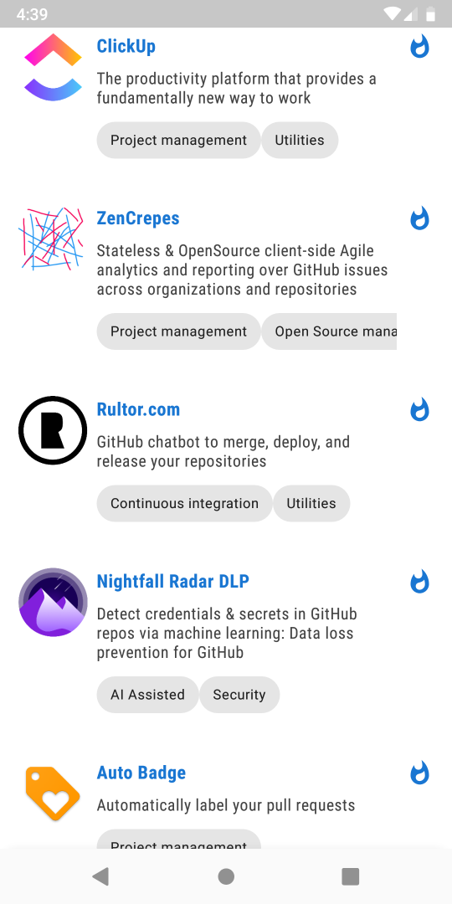

# Retrofit Converter - With GraphQL Support &nbsp; [](https://jitpack.io/#AniTrend/retrofit-graphql) &nbsp; [](https://www.codacy.com/app/anitrend/retrofit-graphql?utm_source=github.com&amp;utm_medium=referral&amp;utm_content=AniTrend/retrofit-graphql&amp;utm_campaign=Badge_Grade) &nbsp; [](https://travis-ci.org/anitrend/retrofit-graphql)

Seeing how we already have a really powerful type-safe HTTP client for Android and Java
[Retrofit](http://square.github.io/retrofit/) why not use it and extend it's functionality,
this project is a retrofit converter which uses annotations to inject .graphql query or mutation
file contents into a request body along with any GraphQL variables.

## Why This Project Exists?

Many might wonder why this exists when an android GraphQL library like [Apollo](https://github.com/apollographql/apollo-android) exists. Unfortunately Apollo for Android still lacks some basic but important features/functionality which led to the following questions about [General Design Questions Regarding Apollo](https://github.com/apollographql/apollo-android/issues/847), [Polymorphic Type Handling](https://github.com/apollographql/apollo-android/issues/334) and [Non Shared Types](https://github.com/apollographql/apollo-android/issues/898). Don't get me wrong Apollo is not inferior any way, it has amazing features such as:

- Code Generation (Classes and Data Types)
- Custom Scalar Types
- Cached Responses

But since model classes are automatically generated for you, the developer loses some flexibility, such as use of generics, abstraction and inheritance.
Also Android Performance best practice suggests that developers should use StringDef and IntDef over
enums and [here's why](https://stackoverflow.com/questions/29183904/should-i-strictly-avoid-using-enums-on-android), with the exception of kotlin
especially when using R8.

Strangely there are tons of simple examples all over Medium using apollo graphql for Android,
but none of them address these issues because most of them just construct a simple single resource
request demo application. These look just fine at first glance until you start working with multiple data types and apollo starts generating classes for every fragment and query even if the data models are the same, or share similar properties.

See a list of changes from [here](./CHANGELOG.md)
____

## How Everything Works

### Getting Started

- __Add the JitPack repository to your build file__

```javascript
allprojects {
    repositories {
        ...
        maven { url 'https://jitpack.io' }
    }
}
```

- __Add the dependency__

```javascript
dependencies {
    implementation 'com.github.anitrend:retrofit-graphql:{latest_version}'
}
```

- __Optional R8 / ProGuard Rules__

If you are using R8 the shrinking and obfuscation rules are included automatically.

ProGuard users must manually copy the options from [this file](https://github.com/anitrend/retrofit-graphql/blob/master/library/proguard-rules.pro).

> You might also need [retrofit rules](https://github.com/square/retrofit/blob/master/retrofit/src/main/resources/META-INF/proguard/retrofit2.pro) and it's dependencies (OkHttp and Okio)

### Examples

Define, your `.graphql` files for your GraphQL queries, fragments, and mutations e.t.c.

If you use insomnia you can use this tool to generate your workspaces into directories and files
[insomnia-graphql-generator](https://github.com/anitrend/insomnia-graphql-generator). After you can
simply place the generated content into your assets folder e.g.:


> **N.B.** You might find this too useful too JetBrains [JS GraphQL - Plugin](https://plugins.jetbrains.com/plugin/8097-js-graphql)

For more instructions on how to setup the sample app and other examples with file uploads,
persisted queries, custom loggers, custom graphql files location (outside assets) please visit
the [projects wiki page](https://github.com/anitrend/retrofit-graphql/wiki)

#### Screenshots

 
 
